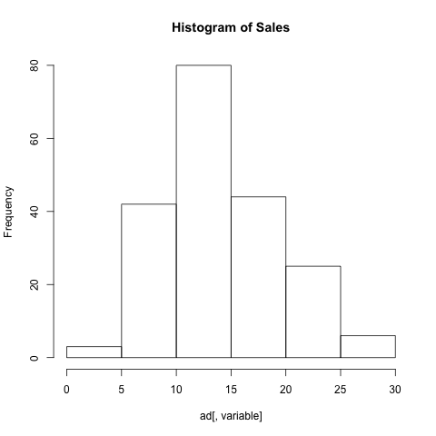
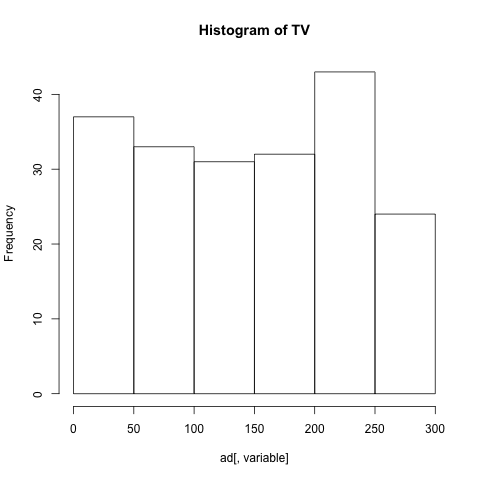
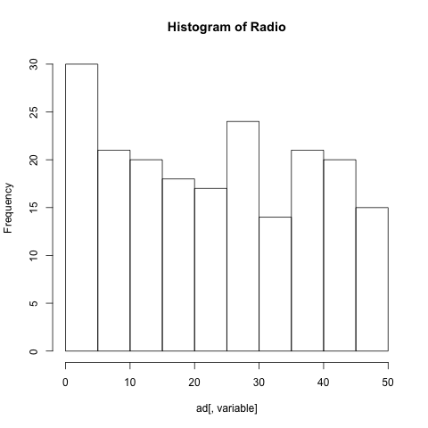
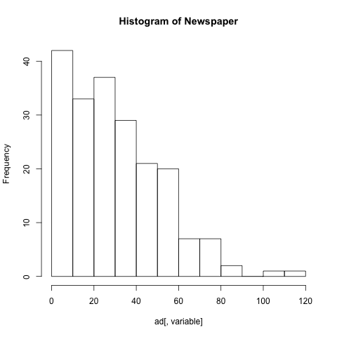

## Abstract
The purpose of assignment is to extend the scope of simple regression with one predictor to multiple regression with many predictors. This analysis will reproduce the regression performed in Section 3.2 from the book, "An Introduction to Statistical Learning" (by James et al).

## Introduction
Using the Advertising data set, Sales will be regressed onto the Advertising mediums (TV, Radio, and Newspaper) via the linear model. A simple regression onto each predictor is not sufficient enough to provide evidence of an association between the response and specific predictors. A multiple regression will include all predictors into one linear equation and will more accurately predict the response Sales. In this project, both simple and multiple regression will be fit onto the data set, and a comparison of the two models will be analyzed.

```{r,echo=FALSE}
library(xtable)
options(xtable.comment = FALSE)
options(knitr.comment = FALSE)
load('../data/regression.RData')
load('../data/correlation-matrix.RData')
source('../code/functions/regression-functions.R')
```

## Data
The Advertising data set consists of Sales (in thousands of units) in 200 different markets, along with advertising budgets for the product in each of those markets for three different media: TV, radio, and newspaper. In this analysis, we will look into the relationship between product Sales and all advertising budgets.

Before performing a linear regression on the data set, it is important to look at some plots of the variables.

```{r, out.width = "200px", echo=FALSE, message=FALSE, fig.align='center'}

```

The histogram of sales looks approximately normal, ignoring the fact that there are only 200 observations.

```{r, out.width = "200px", echo=FALSE,message=FALSE, fig.align ='center'}

```

The histogram of TV advertising appears to be uniform as a whole. There are equal frequencies in TV budget choices for all the 200 markets.

```{r, out.width = "200px", echo=FALSE, message=FALSE, fig.align='center'}

```

The histogram of radio advertising looks a little skewed to the right but can be assumed to follow a uniform frqeuncy, implying that only some of the markets prefer to allocate their budget away from radio and more to the other advertising mediums.

```{r, out.width = "200px", echo=FALSE, message=FALSE, fig.align='center'}

```

Compared to the other three histograms, the histogram of newspaper advertising is heavily skewed to the right, much more than the radio histogram. Most of the markets prefer to use less of their resources in newspaper and more in TV and radio. Since the TV histogram frequencies average around 40 at almost every level of TV budget, it is safe to assume that all markets put much of their advertising emphasis on the TV medium.

## Methodology
In order to compare both types of linear regression models, three simple linear regression should be performed on each of the advertising mediums.

$$Sales = \beta_0 + \beta_1TV$$
$$Sales = \beta_0 + \beta_1Radio$$
$$Sales = \beta_0 + \beta_1Newspaper$$

The following linear equations represents the multiple linear regression onto all the 3 advertising predictors.
$$Sales = \beta_0 + \beta_1TV + \beta_2Radio + \beta_3Newspaper$$ 

Regression plots and their statistics will be shown and evaluated in the next section, and it will be shown that the regression incorporating all the predictors proves to be a better fit to the Advertising data set and thus a better predictive model for Sales.
                         
For each model, using the least squares criterion, estimates of the beta coefficients are calculated to form a fitted regression line from the given n = 200 observations. The sum of residuals in each regressed model will be calculated, and to corresponding statistics will be calculated to properly assess the accuracy of the model (i.e. t-test, F-test).

## Results
The following tables present the results of simple linear regressions on each of the predictor variables. The beta coefficients as well as their t-statistics with their converted p-values are shown.
```{r,echo=FALSE,results='asis'}
tv.sum <- summary(tv.fit)
xtable(tv.sum$coefficients, caption = 'Simple linear regression of Sales onto TV')
```

The estimated beta coefficients for the TV predictor identifies a strong association with the response variable, Sales. The absolute value of the estimation is small, but it is proper to look at the normalized estimations by dividing the coefficient by its standard error, which is equal to the t-statistic. Since the t-statistic is high, the p-value is considerably low enough to reject the null hypthesis that there is no association between the response and the predictor. Thus, it is comfortable to state a strong dependence on TV to increase Sales. This conclusion is supported by the previous statements, emphasizing how the height of TV advertising frequencies is the highest out of all the predictors, so TV's influence is the strongest.

```{r,echo=FALSE,results='asis'}
radio.sum <- summary(radio.fit)
xtable(radio.sum$coefficients, caption = 'Simple linear regression of Sales onto Radio')
```

The beta coefficient relating to the Radio predictor also has a p-value low enough to reject the null hypthesis, which assumes the t-distribution. Thus, there is an association between Radio and Sales but not as strong as the association between TV and Sales.

```{r,echo=FALSE,results='asis'}
news.sum <- summary(news.fit)
xtable(news.sum$coefficients, caption = 'Simple linear regression of Sales onto Newspaper')
```

The beta coefficient for the Newspaper predictor shows a low p-value, which rejects the null hypothesis. It is valid to assert a relationship between Newspaper advertising and Sales. However, out of these three simple linear regressions, the beta coefficient for Newspaper seems to have the weakest relationship to the reponse variable. In the next fitted model for multiple regression, this somewhat weak relationship will become apparent.

```{r,echo=FALSE,results = 'asis'}
lm.sum <- summary(lm.fit)
xtable(lm.sum$coefficients, caption = 'Multiple linear regression of Sales onto Three Advertising Mediums')
```

When Sales is regressed onto all the advertising mediums, all the t-statistics for the beta coefficients are high except the coefficient for the Newspaper medium. This insignificant p-value suggest that it is not justified to reject the null hypothesis. Thus, though a negative estimated beta coefficient, the Newspaper medium will not show a strong association to the response variable, Sales. 

This unique case is caused by a dependency among the predictor variables. When one of the predictors is highly correlated with another predictor via confounding or other causations, the estimated beta coefficients will adjust to this correlation. The following figure displys the correlation matrix, which shows every combination of correlation among the predictors.

```{r,echo=FALSE, results= 'asis'}
xtable(corr_mat, caption = 'Correlation matrix of TV, Radio, and Newspaper Advertising Variables')
```


## Conclusion


