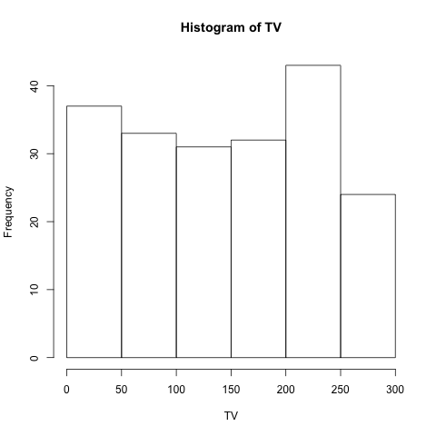
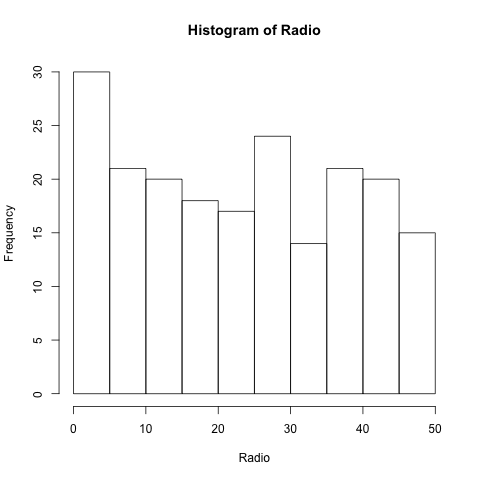

## Abstract
The purpose of this assignment is to extend the scope of simple regression with one predictor to multiple regression with many predictors. This analysis will reproduce the regression performed in Section 3.2 from the book, "An Introduction to Statistical Learning" (by James et al).

## Introduction
Using the Advertising data set, Sales will be regressed onto the Advertising mediums (TV, Radio, and Newspaper) via the linear model. A simple regression onto each predictor is not sufficient enough to provide evidence of an association between the response and specific predictors. A multiple regression will include all predictors into one linear equation and will more accurately predict the response Sales. In this project, both simple and multiple regression will be fit onto the data set, and a comparison of the two models will be done.

```{r,echo=FALSE}
library(xtable)
options(xtable.comment = FALSE)
options(knitr.comment = FALSE)
load('../data/regression.RData')
load('../data/correlation-matrix.RData')
source('../code/functions/regression-functions.R')
```

## Data
The Advertising data set consists of Sales (in thousands of units) in `200` different markets, along with advertising budgets for the product in each of those markets for three different media: TV, radio, and newspaper. In this analysis, we will look into the relationship between product Sales and all advertising budgets.

Before performing a linear regression on the data set, it is important to look at some plots of the variables.

```{r, out.width = "200px", echo=FALSE, message=FALSE, fig.align='center'}
knitr::include_graphics("../images/histogram-sales.png")
```

The histogram of sales looks approximately normal, ignoring the fact that there are only `200` observations.

```{r, out.width = "200px", echo=FALSE,message=FALSE, fig.align ='center'}

```

The histogram of TV advertising appears to be uniform as a whole. There are approximately equal frequencies in TV budget choices for all the `200` markets.

```{r, out.width = "200px", echo=FALSE, message=FALSE, fig.align='center'}

```

The histogram of radio advertising looks a little skewed to the right but can be assumed to follow a uniform frequency, implying that only some of the markets prefer to allocate their budget away from radio and more to the other advertising mediums.

```{r, out.width = "200px", echo=FALSE, message=FALSE, fig.align='center'}
knitr::include_graphics("../images/histogram-newspaper.png")
```

Compared to the other three histograms, the histogram of newspaper advertising is heavily skewed to the right, much more than the radio histogram. Most of the markets prefer to use less of their resources in newspaper and more in TV and radio. Since the TV histogram frequencies average around 40 at almost every level of TV budget, it is safe to assume that all markets put much of their advertising emphasis on the TV medium.

## Methodology
In order to compare both types of linear regression models, three simple linear regression should be performed on each of the advertising mediums.

$$Sales = \beta_0 + \beta_1TV$$
$$Sales = \beta_0 + \beta_1Radio$$
$$Sales = \beta_0 + \beta_1Newspaper$$

The following linear equations represents the multiple linear regression onto all the 3 advertising predictors.
$$Sales = \beta_0 + \beta_1TV + \beta_2Radio + \beta_3Newspaper$$ 

Regression plots and their statistics will be shown and evaluated in the next section, and it will be shown that the regression incorporating all the predictors proves to be a better fit to the Advertising data set and thus a better predictive model for Sales.
                         
For each model, using the least squares criterion, estimates of the beta coefficients are calculated to form a fitted regression line from the given `n = 200` observations. The sum of residuals in each regressed model and useful statistics will be calculated to properly assess the accuracy of the model (i.e. t-test, F-test).

## Results
The following tables present the results of simple linear regressions on each of the predictor variables. The beta coefficients as well as their t-statistics with their converted p-values are shown.

```{r,echo=FALSE,results='asis', message=FALSE}
tv.sum <- summary(tv.fit)
xtable(tv.sum$coefficients, caption = 'Simple linear regression of Sales onto TV')
```

The estimated beta coefficient for the TV predictor identifies a strong association with the response variable, Sales. The absolute value of this estimation is small, but it is proper to look at the normalized estimations by dividing the coefficient by its standard error, which is equal to the t-statistic. Since the t-statistic is high, the p-value is considerably low enough to reject the null hypothesis that there is no association between the response and the predictor. Thus, it is comfortable to state a strong dependence on TV to increase Sales. This conclusion is supported by the previous statements, emphasizing how the height of TV advertising frequencies of the histogram is the highest out of all the predictors, so TV's influence is the strongest.

```{r,echo=FALSE,results='asis', message=FALSE}
radio.sum <- summary(radio.fit)
xtable(radio.sum$coefficients, caption = 'Simple linear regression of Sales onto Radio')
```

The beta coefficient relating to the Radio predictor also has a p-value low enough to reject the null hypthesis, which assumes the t-distribution. Thus, there is an association between Radio and Sales but not as strong as the association between TV and Sales since the t-statistic is lower in this case.

```{r,echo=FALSE,results='asis', message=FALSE}
news.sum <- summary(news.fit)
xtable(news.sum$coefficients, caption = 'Simple linear regression of Sales onto Newspaper')
```

The beta coefficient for the Newspaper predictor shows a low p-value, which rejects the null hypothesis. It is valid to assert a relationship between Newspaper advertising and Sales. However, out of these three simple linear regressions, the beta coefficient for Newspaper seems to have the weakest relationship to the response variable. In the next fitted model for multiple regression, this somewhat weak relationship will become apparent.
```{r,echo=FALSE,results = 'asis', message=FALSE}
lm.sum <- summary(lm.fit)
xtable(lm.sum$coefficients, caption = 'Multiple linear regression of Sales onto Three Advertising Mediums')
```

When Sales is regressed onto all the advertising mediums, all the t-statistics for the beta coefficients are high except the coefficient for the Newspaper medium. This insignificant p-value suggest that it is not justified to reject the null hypothesis. Thus, though a negative estimated beta coefficient, the Newspaper medium will not show a strong association to the response variable, Sales. 

\newpage

This unique case is caused by a dependency among the predictor variables. When one of the predictors is highly correlated with another predictor via confounding or other causations, the estimated beta coefficients will adjust to this correlation. The following figure displys the correlation matrix, which shows every combination of correlation among the predictors.

```{r,echo=FALSE, results= 'asis', message=FALSE}
xtable(corr_mat, caption = 'Correlation matrix of TV, Radio, and Newspaper Advertising Variables')
```

Looking at the Sales columns in the correlation matrix, TV has the highest correlation which can also support the claim that this advertising medium has the highest influence on Sales. Ignoring the Sales column, all correlations seems to insignificant except the correlation between the Radio and Newspaper predictors. Since there is a dependency among the predictors, the insignificant p-value in the Newspaper predictor in the multiple regression model can be explained. The low t-statistic in the Newspaper predictor when regressed on multiple variables show that the Newspaper does not directly impact Sales. It is more proper to notice that the increase in Newspaper advertising would bring about a higher increase in Radio advertising. This indirect effect causes the beta coefficient of the Newspaper medium in both simple and multiple regressions to vary.

The table below presents a standard assessment of the accuracy of the multiple linear regression of Sales onto the three Advertising mediums.

```{r,echo=FALSE, results='asis'}
table = matrix(nrow = 3, ncol = 2)
quantities = c("Residual Std Error", "R_Squared", "F-statistic")
values = c(residual_std_error(lm.fit), r_squared(lm.fit), f_statistic(lm.fit))
table[,1] = quantities
table[,2] = values
colnames(table) = c('Quantity', 'Value')
xtable(table, caption = "Quality Indices of Sales onto TV, Radio and Newspaper Advertising Mediums")
```

The residual standard error relative to the scale of the Advertising budgets is low; the accuracy of the prediction onto the data set can be stated as strong due to these small residuals. In addition, the R_squared value is at `0.9`, a very high indicator for a strong fit to the Advertising data set. These two quality indices can assure the regressed model to be a strong fit. In some cases, the fit might be a case of overfitting, where the model is so carefully fitted onto the training set that the test error explodes when performed. Since the number of predictors is small in comparison to the number of samples taken from the markets, the multiple regression model is not flexible enough to be considered as an overfitting case. It is safe to assume the model to be a strong fit to the Advertising data set, and thus a strong predictor for Sales.

The F-test finds out if at least one of the predictor variables shows a strong assosication with the response variable. This test does not find out which variable(s) has this association, but knowing its existence is important. The large F-statistic of `570` corresponds to a low p-value of the F-test; Therefore, the null hypothesis that assumes the F-distribution is rejected. In other words, at least one of the beta coefficients in the model indicate a strong relationship with Sales. 

Since the estimatated beta coefficient for Newspaper advertising shows a weak association to Sales, omitting the Newspaper variable from the model can be option in order to better the fit. Subset selection (i.e. forward, backward, mixed selection) and incorporating the adjusted R_squared quality index can be used to compare the models with varying number of predictors.

## Conclusion
Both the simple and multiple regression models were fitted onto the Advertising data set. After analyzing each model and assessing certain statistics of the fit, the multiple regression model is the better of the two since having more predictors can explain more of the variance in the response Sales. More information about the response would give a high R_squared and low Residual Standard error, or in other words, a better fit. 


